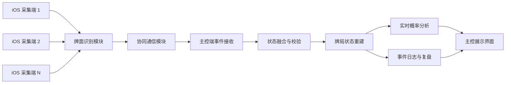
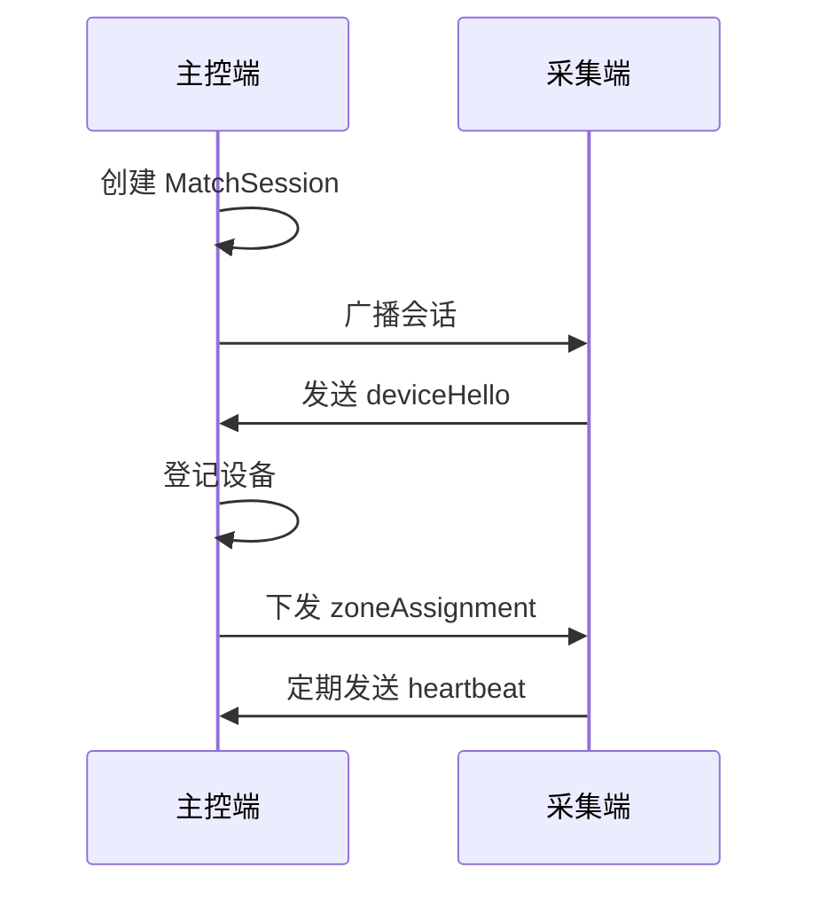
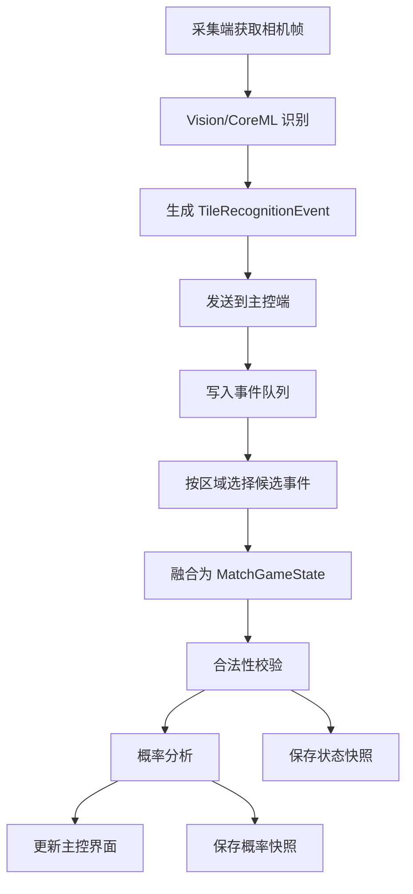

# 系统设计文档

## 1. 文档目的

本文档用于说明 `MahjongVisionSync` 的系统设计。项目中文题目为“基于多 iOS 终端协同感知的麻将比赛牌局状态识别与实时概率分析系统的设计与实现”。

当前仓库已经具备单 iOS 终端麻将手牌录入、听牌/胡牌计算、相机采集、CoreML 牌面识别和扫描结果确认能力。本文档在现有代码基础上，设计后续面向毕业设计目标的多终端协同、牌局状态重建、实时概率分析和复盘记录模块。

本文档适合作为论文第 4 章“系统总体设计”和第 5 章“系统详细设计与实现”的基础材料。

## 2. 系统边界

### 2.1 面向对象

系统面向麻将比赛场景中的赛事组织方、裁判人员、转播数据人员和赛后复盘人员。系统不面向参赛选手提供实时决策辅助，实时概率分析结果用于赛事记录、转播展示、裁判辅助和赛后复盘。

### 2.2 系统输入

- iOS 摄像头采集到的麻将牌桌画面。
- CoreML 模型输出的牌面类别、位置和置信度。
- 多台 iOS 终端的设备身份、设备角色和拍摄区域。
- 用户在主控端进行的规则选择、区域绑定和人工确认。

### 2.3 系统输出

- 统一重建后的牌局状态。
- 各区域识别结果和冲突提示。
- 听牌、有效牌、剩余有效牌数量和摸入有效牌概率。
- 牌局事件日志和赛后复盘数据。
- 面向裁判、转播和复盘人员的可视化界面。

### 2.4 非目标

第一版原型不实现联网服务器、不做云端账号系统、不向比赛选手提供实时出牌建议，也不追求完整覆盖所有地方麻将规则。系统优先保证多端同步、状态重建、基础概率指标和可演示性。

## 3. 当前实现基础

仓库中现有代码位于 `MahjongTing/`，Xcode 工程仍保留 `MahjongTing` Target 名称，仓库展示名称为 `MahjongVisionSync`。

| 文件 | 当前职责 |
| --- | --- |
| `App.swift` | SwiftUI 应用入口和屏幕方向控制 |
| `MainView.swift` | 单机手牌录入、结果展示和设置入口 |
| `ViewModel.swift` | 手牌状态、规则选项、计算调度 |
| `Engine.swift` | 胡牌、听牌、有效牌和副露相关计算 |
| `Camera.swift` | AVCapture 相机采集、预览帧和扫描帧管理 |
| `CameraPreview.swift` | 相机预览视图封装 |
| `ScanView.swift` | 扫描界面、识别结果确认和覆盖层展示 |
| `Recognizer.swift` | Vision/CoreML 目标检测、候选融合和排序 |
| `ScanTypes.swift` | 扫描状态、帧快照等类型 |
| `ScanApply.swift` | 扫描结果应用到手牌状态 |
| `Meld.swift` | 副露数据结构 |
| `Localization.swift` | 中英日多语言文案 |
| `Style.swift` | UI 样式辅助 |

现有实现可作为“单端采集与分析能力”的基础。后续扩展应尽量复用 `Engine.swift` 的规则计算能力和 `Recognizer.swift` 的识别能力，不应先重写已有功能。

## 4. 总体架构

系统采用“采集端 + 主控端”的多 iOS 终端协同架构。采集端负责拍摄指定牌桌区域并产生识别事件，主控端负责接收多端事件、融合状态、计算概率并展示结果。



系统划分为四层：

1. 感知采集层：调用相机采集画面，使用 Vision/CoreML 识别麻将牌。
2. 协同通信层：完成多设备发现、连接、心跳和识别事件传输。
3. 状态分析层：融合多端识别结果，维护统一牌局状态并计算概率指标。
4. 展示复盘层：展示当前状态、冲突、概率趋势和历史事件。

## 5. 设备角色设计

### 5.1 主控端

主控端由赛事工作人员或裁判使用，负责创建比赛会话、管理采集端、接收识别事件、展示牌局状态、保存复盘数据。

主控端核心能力：

- 创建或结束比赛会话。
- 为采集端绑定拍摄区域。
- 接收采集端发送的识别事件。
- 对多端识别结果进行融合和合法性校验。
- 计算听牌、有效牌和概率趋势。
- 保存事件日志和概率快照。

### 5.2 采集端

采集端由 iPhone 或 iPad 充当，固定在牌桌周围拍摄一个区域。采集端不直接修改全局牌局状态，只产生带时间戳和置信度的识别事件。

采集端核心能力：

- 加入主控端创建的比赛会话。
- 上报设备名称、设备角色和拍摄区域。
- 调用相机和识别模型获得牌面结果。
- 将识别结果封装为事件发送给主控端。
- 在断连或识别异常时提示工作人员。

## 6. 功能模块设计

### 6.1 感知采集模块

感知采集模块复用现有 `Camera.swift`、`ScanView.swift` 和 `Recognizer.swift`。采集端通过 AVCapture 获取画面，并由 Vision/CoreML 返回牌面类别、位置和置信度。

设计要点：

- 采集帧包含像素缓冲区、采集时间戳和方向信息。
- 识别结果使用 34 类麻将牌索引表示，便于和现有 `Engine.swift` 对接。
- 多帧识别结果先在采集端做轻量稳定化，再上报主控端。
- 对低置信度结果不直接丢弃，而是在事件中保留置信度，交由主控端融合和提示。

### 6.2 多终端协同模块

多终端协同模块建议第一版使用 `MultipeerConnectivity`。该方案无需额外服务器，适合毕业设计中 2 到 3 台 iOS 设备的局域近场演示。

设计职责：

- 主控端广播比赛会话。
- 采集端发现并请求加入会话。
- 主控端维护在线设备列表。
- 设备之间使用 JSON 编码的消息体传输事件。
- 采集端定期发送心跳，主控端根据最近心跳时间判断在线状态。

消息类型建议：

```swift
enum MatchMessageType: String, Codable {
    case deviceHello
    case deviceHeartbeat
    case zoneAssignment
    case recognitionEvent
    case hostStateSnapshot
    case errorReport
}
```

### 6.3 识别事件模块

识别结果不应直接修改牌局状态，而应先封装为事件。事件化设计可以让系统同时支持实时融合、冲突回溯和赛后复盘。

核心结构建议：

```swift
struct TileRecognitionEvent: Identifiable, Codable {
    let id: UUID
    let matchID: UUID
    let deviceID: UUID
    let zone: TableZone
    let capturedAt: Date
    let receivedAt: Date
    let tiles: [RecognizedTile]
}

struct RecognizedTile: Identifiable, Codable {
    let id: UUID
    let tileIndex: Int
    let confidence: Float
    let normalizedRect: CodableRect
}
```

其中 `capturedAt` 表示采集端拍摄时间，`receivedAt` 表示主控端收到事件的时间。两者可用于估算通信延迟和进行事件排序。

### 6.4 状态融合与重建模块

状态融合模块位于主控端，负责把多个采集端的识别事件转换为统一牌局状态。

第一版融合策略保持可解释：

- 同一区域优先采用最近 2 秒内的事件。
- 同一区域多条事件取置信度平均值更高的一组作为候选状态。
- 同一设备连续多帧结果差异较小时认为状态稳定。
- 任一牌种总数量超过 4 张时标记为非法状态。
- 不确定或冲突结果交给人工确认，不自动强行修正。

状态重建结果建议使用如下结构：

```swift
struct MatchGameState: Codable {
    var matchID: UUID
    var players: [PlayerSeat: PlayerState]
    var discardCounts: [Int]
    var meldCounts: [Int]
    var visibleCounts: [Int]
    var zoneStatuses: [TableZone: ZoneStatus]
    var conflicts: [StateConflict]
    var updatedAt: Date
}
```

其中 `visibleCounts` 表示系统已经确认可见的牌数，长度为 34。合法性校验时，每个索引对应牌的总数量不能超过 4。

### 6.5 实时概率分析模块

概率分析模块复用现有 `Engine.swift` 的听牌和胡牌判断能力，并在其外层增加比赛场景包装。该模块不直接处理图像识别，只接收已经融合后的手牌、已见牌和副露状态。

第一版输出指标：

- 是否听牌。
- 听牌列表。
- 有效牌数量。
- 剩余有效牌数量。
- 剩余未知牌数量。
- 摸入有效牌概率。
- 状态变化后的概率快照。

简化概率公式：

```text
摸入有效牌概率 = 剩余有效牌数量 / 剩余未知牌数量
```

概率快照结构建议：

```swift
struct ProbabilitySnapshot: Identifiable, Codable {
    let id: UUID
    let matchID: UUID
    let player: PlayerSeat
    let createdAt: Date
    let winningTiles: [Int]
    let effectiveTileCount: Int
    let remainingEffectiveTileCount: Int
    let unknownTileCount: Int
    let drawEffectiveProbability: Double
}
```

### 6.6 展示模块

展示模块分为单机听牌界面和比赛主控界面。当前 `MainView.swift` 保留单机手牌录入和扫描分析能力，后续新增比赛入口，不直接破坏现有主流程。

比赛主控界面建议包含：

- 会话状态：当前比赛 ID、在线设备数量、连接状态。
- 设备列表：设备名称、角色、拍摄区域、最近心跳时间。
- 牌局状态概览：四家手牌、弃牌区、副露区、已见牌统计。
- 冲突面板：非法牌数、低置信度区域、断连设备。
- 概率分析面板：每家听牌、有牌数量、剩余有效牌概率。
- 事件时间线：采集事件、人工确认、状态更新、概率快照。

### 6.7 复盘存储模块

第一版复盘存储建议使用本地 JSON 文件。相较 SQLite 或 CoreData，JSON 文件更容易在论文中解释，也便于调试和展示。

建议每局比赛保存一个目录：

```text
Replays/
  <match-id>/
    match.json
    devices.json
    events.json
    state_snapshots.json
    probability_snapshots.json
```

其中 `events.json` 保存原始识别事件，`state_snapshots.json` 保存融合后的状态快照，`probability_snapshots.json` 保存概率分析结果。复盘时先读取事件，再按时间顺序重放状态变化。

## 7. 核心数据模型

### 7.1 设备与区域

```swift
struct MatchDevice: Identifiable, Codable {
    let id: UUID
    var displayName: String
    var role: DeviceRole
    var zone: TableZone
    var lastSeenAt: Date
}

enum DeviceRole: String, Codable {
    case host
    case capture
}

enum TableZone: String, Codable {
    case playerHandEast
    case playerHandSouth
    case playerHandWest
    case playerHandNorth
    case discardArea
    case meldArea
    case fullTable
}
```

### 7.2 玩家与牌局状态

```swift
enum PlayerSeat: String, Codable, CaseIterable {
    case east
    case south
    case west
    case north
}

struct PlayerState: Codable {
    var concealedCounts: [Int]
    var meldCounts: [Int]
    var discardCounts: [Int]
    var lastUpdatedAt: Date
}
```

### 7.3 冲突与区域状态

```swift
struct ZoneStatus: Codable {
    var zone: TableZone
    var sourceDeviceID: UUID?
    var confidenceAverage: Float
    var lastEventAt: Date?
    var status: ZoneRecognitionStatus
}

enum ZoneRecognitionStatus: String, Codable {
    case idle
    case stable
    case lowConfidence
    case conflict
    case disconnected
}

struct StateConflict: Identifiable, Codable {
    let id: UUID
    let createdAt: Date
    let conflictType: ConflictType
    let message: String
    let relatedTileIndex: Int?
    let relatedZone: TableZone?
}

enum ConflictType: String, Codable {
    case tileCountOverflow
    case lowConfidence
    case deviceDisconnected
    case zoneMismatch
}
```

## 8. 主要业务流程

### 8.1 比赛会话创建流程



### 8.2 识别事件处理流程



### 8.3 冲突处理流程

当系统发现冲突时，不直接覆盖已有状态，而是生成 `StateConflict` 并展示给主控端用户。

典型冲突包括：

- 同一张牌总数超过 4 张。
- 某区域识别置信度持续过低。
- 设备断连导致区域状态过期。
- 两台设备上报的同一区域结果差异较大。

处理策略：

1. 标记冲突区域。
2. 保留原始事件和候选状态。
3. 暂停该区域自动更新或降低其权重。
4. 提供人工确认入口。
5. 人工确认后写入确认事件，继续后续融合。

## 9. 异常处理设计

### 9.1 识别异常

- 未检测到牌：提示调整拍摄角度、距离和光照。
- 检测牌数不足：提示重新摆放或重新扫描。
- 置信度过低：主控端标记 `lowConfidence`，不立即覆盖稳定状态。

### 9.2 通信异常

- 心跳超时：主控端标记设备断连。
- 消息解码失败：记录错误事件，不影响其他设备。
- 短时断连：采集端重连后继续上报，主控端按时间戳排序处理。

### 9.3 状态异常

- 牌数超过 4 张：生成 `tileCountOverflow` 冲突。
- 区域绑定错误：生成 `zoneMismatch` 冲突。
- 状态缺失：界面展示未知状态，不使用默认值伪造结果。

## 10. 测试设计

### 10.1 单元测试

- `Engine.swift`：固定手牌输入，验证听牌和胡牌输出。
- 概率分析模块：输入有效牌和已见牌，验证剩余有效牌和概率。
- 状态融合模块：输入多组事件，验证融合结果和冲突输出。
- JSON 存储模块：保存后重新读取，验证数据一致。

### 10.2 集成测试

- 一台主控端和一台采集端建立连接。
- 采集端发送识别事件，主控端显示区域状态。
- 主控端检测非法牌数并展示冲突。
- 事件日志保存后可以重新加载并回放。

### 10.3 性能与效果测试

- 识别准确率：使用固定图片集统计识别牌数和类别准确率。
- 通信延迟：统计 `receivedAt - capturedAt` 的平均值和最大值。
- 状态更新时间：统计事件到达后主控界面更新耗时。
- 复盘完整性：对比实时状态和事件重放后的最终状态。

## 11. 分阶段实现计划

第一阶段保留现有单机功能，整理比赛模式入口和数据模型。

第二阶段实现 `MultipeerConnectivity` 会话、设备发现、加入、心跳和区域绑定。

第三阶段将扫描识别结果封装为 `TileRecognitionEvent`，实现采集端到主控端的数据上报。

第四阶段实现主控端状态融合、合法性校验和冲突展示。

第五阶段新增 `ProbabilityAnalyzer`，计算剩余有效牌数量和摸入有效牌概率。

第六阶段实现 JSON 复盘文件保存和事件时间线展示。

第七阶段补充测试样例、演示数据和论文截图。

## 12. 与论文结构的对应关系

| 论文章节 | 可使用本文档内容 |
| --- | --- |
| 第 3 章 系统需求分析 | 系统边界、输入输出、非目标 |
| 第 4 章 系统总体设计 | 总体架构、设备角色、业务流程 |
| 第 5 章 系统详细设计与实现 | 功能模块、核心数据模型、异常处理 |
| 第 6 章 系统测试与结果分析 | 测试设计、性能与效果测试 |

## 13. 设计取舍

本系统优先选择可解释、可演示、可测试的实现路线。多端通信使用 `MultipeerConnectivity`，是因为毕业设计演示环境通常在同一局域或近场设备范围内，不需要额外部署服务器。复盘数据第一版使用 JSON，是因为事件日志和状态快照更容易被检查、导出和写入论文。概率分析先采用剩余有效牌比例模型，是因为它能和当前听牌算法自然衔接，并且计算过程容易解释。

后续如果需要扩展到正式赛事系统，可以进一步引入服务器中继、数据库存储、更复杂的概率模型和更严格的设备标定流程。
