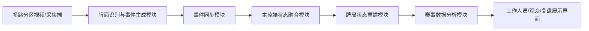

# 基于多路视频分区感知的麻将赛事牌局状态识别与观众数据展示系统的设计与实现

## 1. 选题定位

本课题拟设计并实现一套面向麻将赛事场景的牌局数据采集、状态识别、观众展示与赛后复盘系统。系统通过多路比赛视频或多台采集设备对牌桌不同区域进行分区感知，利用视频抽帧、牌面识别、事件同步与状态重建算法，将比赛过程转换为结构化牌局数据。

本系统的使用对象为赛事组织方、裁判人员、转播数据人员、内容制作人员和观众，不面向参赛选手提供实时决策辅助。系统输出结果主要用于赛事记录、转播展示、裁判核验、观众理解牌局和赛后复盘分析。

本课题不是单纯实现一个麻将牌面识别模型，也不是面向选手的麻将助手。牌面识别只是系统输入层能力，核心研究对象是多路视频分区感知后的牌局事件生成、状态重建、合法性校验、观众数据展示和复盘记录。

## 2. 研究背景

麻将比赛具有信息密集、状态变化快、人工记录难度高等特点。传统比赛记录主要依赖人工观察、手动录入或赛后整理，存在以下问题：

- 记录效率低，难以完整保存比赛过程。
- 人工记录容易漏记、错记，影响赛后复盘准确性。
- 转播展示缺少实时数据支撑，观众难以直观看到牌局变化。
- 裁判在争议回看和牌局核验时缺少结构化数据辅助。

随着移动设备性能提升和视频分析技术发展，普通摄像设备、iOS 终端和公开视频素材已经可以用于构建低成本赛事数据采集原型。通过将四路选手手牌区视频和一路弃牌区视频或人工校正输入统一建模，可以在不依赖昂贵专用硬件的情况下，实现对麻将比赛牌局状态的半自动识别、结构化记录和可视化展示。

## 3. 研究意义

### 3.1 实际应用意义

本课题可以为麻将赛事提供低成本的数据化采集方案，减少人工录入工作量，提高比赛记录的完整性和可追溯性。系统生成的牌局状态、听牌信息、有效牌统计和趋势数据可用于赛事转播、裁判辅助、观众解说和赛后复盘，提升比赛的信息化与可视化水平。

### 3.2 工程实践意义

本课题综合涉及视频数据处理、iOS 应用开发、摄像头采集、CoreML 识别、多路事件同步、状态融合、概率分析和可视化展示，符合软件工程专业毕业设计对综合性、实践性和系统完整性的要求。

### 3.3 技术研究意义

本课题围绕麻将赛事中的多源感知、牌局状态重建和观众数据展示展开。其关键技术问题包括多路视频事件同步、识别结果融合、牌局状态一致性维护、异常冲突处理和赛事展示指标计算，具有一定研究和实现价值。

## 4. 系统目标

系统最终目标是实现一套可运行的麻将赛事牌局识别与展示原型系统，具备以下能力：

- 支持多路比赛视频或多台采集设备接入同一牌局。
- 支持四路选手手牌区视频识别，弃牌区支持视频识别、人工录入或校正输入。
- 支持将不同区域识别到的数据同步到主控端。
- 支持对牌局状态进行统一重建和校验。
- 支持计算听牌、有效牌、剩余有效牌数量和趋势指标。
- 支持向赛事工作人员和观众以可视化方式展示当前牌局分析结果。
- 支持保存牌局过程数据，供赛后复盘使用。

## 5. 系统使用场景

典型使用流程如下：

1. 比赛前或复盘阶段，系统接入多路比赛视频，典型配置为四路选手手牌区视频和一路弃牌区视频。
2. 当公开视频素材无法稳定覆盖弃牌区时，弃牌事件可由工作人员人工录入或作为校正输入。
3. 系统按区域对视频进行抽帧和牌面识别，生成带时间戳、区域和置信度的识别事件。
4. 主控端融合多路区域事件，形成统一的牌局状态。
5. 系统根据当前牌局状态计算听牌情况、有效牌数量、剩余有效牌和趋势指标。
6. 分析结果提供给裁判、转播数据人员、内容制作人员和观众查看。
7. 比赛选手不接收系统实时分析结果，避免形成比赛决策辅助。

## 6. 总体架构

系统可划分为四层：感知采集层、事件同步层、状态分析层和展示应用层。

### 6.1 感知采集层

负责接入公开比赛视频、固定机位视频或 iOS 摄像头画面，并通过识别模型输出麻将牌类别、位置和置信度。第一版原型优先使用网上比赛视频切分为多路区域视频进行验证，后续可扩展到实时 iOS 采集。

### 6.2 事件同步层

负责多路视频事件或多台采集终端之间的会话管理、数据同步和异常处理。离线视频原型可使用本地事件队列模拟同步，实时采集版本可采用 MultipeerConnectivity、局域网 Socket 或 WebSocket 方案。

### 6.3 状态分析层

负责将多端识别结果转换为统一的牌局状态，包括手牌、弃牌、副露、已见牌和当前回合信息，并对冲突结果进行校验和修正。

### 6.4 展示应用层

负责向赛事工作人员、转播数据人员和观众展示牌局状态、听牌情况、有效牌数量、趋势指标和历史牌局记录。展示端与比赛选手隔离，不作为选手实时决策工具。

## 7. 功能模块设计

### 7.1 多路视频牌面识别模块

- 接入公开比赛视频切流、固定机位视频或 AVCaptureSession 实时画面。
- 使用 Vision/CoreML 进行麻将牌目标检测与分类。
- 输出牌面类别、位置、置信度和时间戳。
- 支持多帧识别和识别结果稳定化。

### 7.2 多路事件同步模块

- 支持多个视频源或采集端加入同一比赛会话。
- 支持按区域向主控端发送识别事件。
- 支持视频源编号、区域绑定和事件时间戳。
- 实时采集版本支持设备心跳、断连提示和数据重传。

### 7.3 牌局状态重建模块

- 根据多端识别结果构建统一牌局状态。
- 维护手牌、弃牌、副露、已见牌等状态。
- 对非法状态进行校验，例如同一张牌超过 4 张。
- 对多端识别冲突进行置信度融合或人工确认。

### 7.4 赛事数据分析模块

本课题中的“概率分析”主要指面向比赛转播、观众理解和赛后复盘的数据指标，不直接向选手提供决策建议。可包括：

- 当前是否听牌。
- 听哪些牌。
- 有效牌数量。
- 剩余有效牌数量。
- 摸入有效牌概率。
- 当前局势变化趋势。
- 基于蒙特卡洛模拟的四家最终获胜份额与流局概率，五项结果归一化为 100%。
- 模拟次数、随机种子、算法版本和不确定性说明。

### 7.5 数据展示与复盘模块

- 展示当前牌局状态。
- 展示各选手席位听牌和有效牌分析结果。
- 展示概率趋势变化。
- 保存关键事件，支持赛后回放和复盘。

## 8. 技术路线

### 8.1 开发平台

- 开发语言：Swift
- UI 框架：SwiftUI
- 采集框架：AVFoundation
- 识别框架：Vision + CoreML
- 多端通信：MultipeerConnectivity 或局域网通信
- 数据存储：本地 JSON / SQLite / CoreData

### 8.2 实现路线

1. 第一阶段：完成比赛视频抽帧、标注样本整理和牌面识别验证。
2. 第二阶段：实现四路手牌区视频输入和区域识别事件生成。
3. 第三阶段：实现主控端牌局状态融合、合法性校验和人工确认。
4. 第四阶段：实现有效牌、剩余牌和趋势指标分析。
5. 第五阶段：完善工作人员/观众展示界面、异常处理和复盘保存。
6. 第六阶段：进行测试、性能评估和论文撰写。

## 9. 可行性分析

### 9.1 技术可行性

目前已有 iOS 端麻将识别和听牌计算基础代码，包含摄像头采集、CoreML 模型识别、手牌录入和胡牌/听牌判断逻辑。后续可在此基础上扩展多路视频输入、识别事件化、状态融合和赛事展示模块。

### 9.2 设备可行性

公开比赛视频可以用于第一版原型的数据抽帧、标注、训练和离线演示；iPhone 和 iPad 均具备摄像头、端侧推理和局域网通信能力，适合作为后续实时赛事采集终端。实际毕设演示阶段可先使用四路手牌区视频切流模拟多机位输入，弃牌区通过可选视频或人工校正补充。

### 9.3 工作量可行性

课题包含多个模块，但可以按阶段实现。若时间有限，可优先保证多端同步、牌局状态识别和蒙特卡洛 equity 三个核心功能；更复杂的选手策略建模、搜索和长期名次预测作为扩展功能。

## 10. 可能的创新点

- 将多路比赛视频用于麻将赛事牌局的分区感知和结构化记录。
- 将牌面识别与牌局状态重建结合，降低人工记谱和复盘整理成本。
- 面向赛事工作人员和观众，提供听牌、有效牌和趋势数据展示。
- 通过多路区域事件融合和合法性校验，提高复杂比赛场景下的数据可靠性。

## 11. 重点与难点

### 11.1 重点

- 多路视频牌面识别。
- 区域事件同步与融合。
- 牌局状态重建。
- 听牌、有效牌和趋势指标分析。
- 面向工作人员和观众的数据展示。

### 11.2 难点

- 多路视频识别结果的时间同步。
- 不同角度下牌面识别结果不稳定。
- 多源数据冲突时的状态融合。
- 麻将牌局状态合法性校验。
- 观众展示指标的合理简化和比赛公平性边界控制。

## 12. 论文结构建议

### 第 1 章 绪论

介绍研究背景、研究意义、国内外相关技术现状、课题主要内容和论文结构。

### 第 2 章 相关技术

介绍 iOS 开发、AVFoundation、Vision/CoreML、多路视频事件同步、实时采集通信、麻将规则计算和赛事展示指标计算方法。

### 第 3 章 系统需求分析

分析系统使用对象、功能需求、非功能需求和比赛场景约束。

### 第 4 章 系统总体设计

介绍系统架构、模块划分、数据流程、通信流程和牌局状态模型。

### 第 5 章 系统详细设计与实现

详细说明多路视频识别模块、事件同步模块、状态重建模块、赛事数据分析模块和展示模块的实现。

### 第 6 章 系统测试与结果分析

进行功能测试、识别准确率测试、事件同步测试、展示指标测试和系统演示结果分析。

### 第 7 章 总结与展望

总结课题完成情况，分析不足，并提出后续改进方向。

## 13. 开题报告可用表述

本课题面向麻将赛事中的赛事记录、裁判辅助、转播展示、观众理解和赛后复盘需求，设计并实现一套基于多路视频分区感知的牌局状态识别与观众数据展示系统。系统利用公开比赛视频切流、固定机位视频或后续 iOS 采集端对选手手牌区和弃牌区进行分区感知，通过识别模型生成带时间戳、区域和置信度的牌面识别事件。主控端对多源事件进行融合与校验，重建当前牌局状态，并进一步计算听牌情况、有效牌数量、剩余有效牌和趋势指标。系统输出结果面向赛事组织方、裁判人员、转播数据人员和观众，不面向参赛选手提供实时决策辅助。

## 14. 推荐题目

基于多路视频分区感知的麻将赛事牌局状态识别与观众数据展示系统的设计与实现
